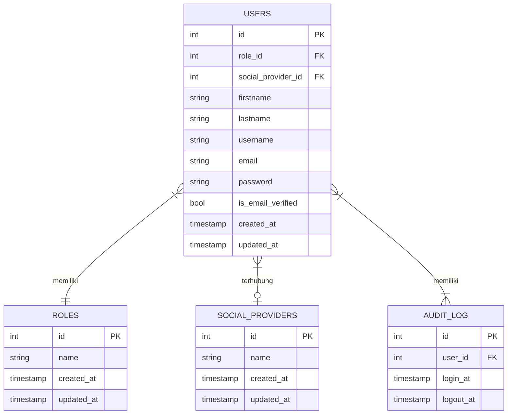

# ERD Authentication Flow

```mermaid
erDiagram
  USERS {
    int id PK
    int role_id FK
    int social_provider_id FK
    string firstname
    string lastname
    string username
    string email
    string password
    bool is_email_verified
    timestamp created_at
    timestamp updated_at
  }

  ROLES {
    int id PK
    string name
    timestamp created_at
    timestamp updated_at
  }

  SOCIAL_PROVIDERS {
    int id PK
    string name
    timestamp created_at
    timestamp updated_at
  }

  AUDIT_LOG {
    int id PK
    int user_id FK
    timestamp login_at
    timestamp logout_at
  }

  USERS }| -- || ROLES : memiliki
  USERS }| -- o| SOCIAL_PROVIDERS : terhubung
  USERS }| -- |{ AUDIT_LOG : memiliki

```